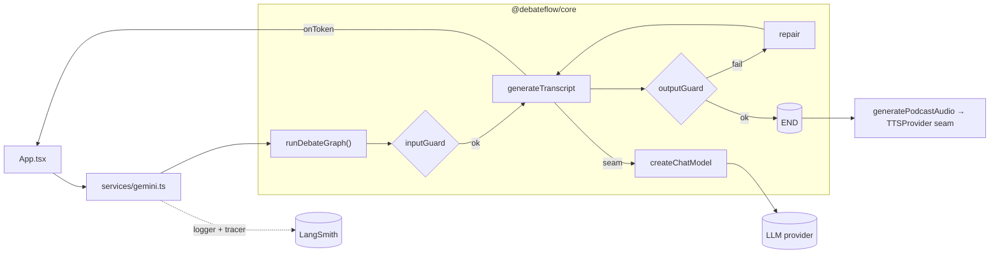

# DebateFlow — Podcast Script Builder

Browser app that turns a raw text script into a paced, two-speaker podcast debate
transcript and then renders it to multi-speaker audio. The generation pipeline is a
**LangGraph** graph with guards; models are reached through a provider-agnostic **seam**;
runs can be traced to LangSmith for evals. Client-side, **BYOK** (bring-your-own-key).

## Monorepo layout (pnpm workspaces)

```
apps/web/                 # React 19 + Vite SPA (UI only). Imports @debateflow/core.
  services/gemini.ts      #   thin orchestration: drives the graph, builds TTS, logging
  services/observability.ts #  in-memory BYOK LangSmith store + tracer builder
  components/ hooks/ constants.ts
packages/core/            # @debateflow/core — framework-agnostic, no React
  src/providers/          #   THE SEAM: createChatModel (registry) + TTSProvider
  src/graph/              #   LangGraph StateGraph (debateGraph.ts, state.ts)
  src/guards/             #   input/output guards (pure, zod for tag schema)
  src/evals/              #   evaluators + judge + seed dataset + runEval.ts
  src/observability/      #   createLangSmithTracer
  src/prompts.ts src/lib/ src/types.ts
packages/config/          # shared tsconfig base
```

`@debateflow/core` is consumed as **source** (no build step): its `exports` map points
`.` → `src/index.ts` and `./evals` → `src/evals/index.ts`. The `./evals` subpath keeps the
Node-only `langsmith` `evaluate()` glue out of the browser bundle.

### Data flow / module boundaries



UI/web depends only on `@debateflow/core`; the seam is the only place a concrete model SDK is
imported. Guards + repair live in the graph; tracing/evals reuse the same seam.

## Stack

- React 19 + TypeScript, **Vite** (`apps/web/vite.config.ts`, dev server on port 3000).
  `.env` is at the repo root; Vite's `envDir` points there.
- **Provider seam** (`packages/core/src/providers/chatModel.ts`): a registry that lazily
  imports only the chat providers it supports (`google-genai`, `openai`). Returns a
  LangChain `BaseChatModel`. Nothing downstream imports a concrete chat SDK. TTS has its
  own `TTSProvider` seam (`GeminiTTSProvider` for multi-speaker).
- **LangGraph** (`@langchain/langgraph/web`): `START → inputGuard → generateTranscript →
  outputGuard → (repair → generateTranscript)* → END`. Streaming preserved via an
  `onToken` callback; repair re-runs call `onReset` so the UI clears first.
- **Vitest** for unit tests (seam, graph, guards, evaluators). **zod** for the output
  speaker-tag schema.
- **Tailwind v4** built at compile time via `@tailwindcss/vite` (plugin in
  `vite.config.ts`; `@import "tailwindcss"` + theme tokens in `apps/web/index.css`,
  imported from `index.tsx`). No runtime CDN — keeps `script-src 'self'` enforceable.
  Accent color `#D0F224` (used as arbitrary values, e.g. `bg-[#D0F224]`).
- **CSP / security headers** ship via `apps/web/public/_headers` (Cloudflare Pages),
  not a `<meta>` tag, so the Vite dev server (needs inline/eval for HMR) is unaffected.
  `script-src 'self'`; `connect-src` is scoped to Gemini + LangSmith — a custom
  LangSmith endpoint on another domain needs an entry added there.

## Commands (run from repo root)

```bash
pnpm dev         # Vite dev server (http://localhost:3000)
pnpm build       # build the web app → apps/web/dist
pnpm preview     # preview the build
pnpm typecheck   # pnpm -r typecheck (tsc --noEmit per package) — the Stop hook runs this
pnpm test        # pnpm -r test (Vitest)
pnpm eval        # offline eval suite — needs GEMINI_API_KEY + LANGSMITH_API_KEY (see docs/EVALS.md)
```

The Stop hook runs `pnpm -r typecheck`. There is no linter/formatter.

## API key handling (BYOK)

- The user pastes their **LLM provider key** in `ApiModal`; it is persisted in the
  browser (`localStorage` key `df_api_key`) and resolved by `services/apiKey.ts`
  (`getApiKey` / `setApiKey` / `hasApiKey`). Asked once, then reused across reloads.
- **Key resolution order** (`services/apiKey.ts`): browser-stored key → dev-only env
  fallback. The dev fallback reads `import.meta.env.VITE_GEMINI_API_KEY` and is gated on
  `import.meta.env.DEV`, so in a production build the branch folds to `undefined` and the
  reference is dropped — **no key is ever inlined into the static bundle.**
- **Do NOT re-introduce a `define` for the API key in `vite.config.ts`.** That inlines a
  build-time secret into the world-readable bundle (this is how a key once leaked publicly).
  Builds must never bake in a key; the eval suite's `GEMINI_API_KEY` is Node-only.
- LangSmith is also BYOK but deliberately **NOT persisted** — optional key + project entered
  in `ApiModal`, held in memory by `services/observability.ts` (asymmetry is intentional:
  the LLM key is persisted, the LangSmith key is not). Traces post browser → LangSmith
  (CORS is open). See `docs/EVALS.md` for wiring online (production) evaluators.
- **Never edit `.env` directly** — a PreToolUse hook blocks it. Change `env.example` instead.

## Conventions

- `core` is framework-agnostic: no React, no concrete provider SDK imports outside the seam.
- The seam is the extension point — add a provider by adding one registry entry + its package.
- Speaker tags use `**[Name]**`; `TTSFormatter` (in `services/gemini.ts`) rewrites them to
  `Name:` before TTS, and the output guard / evaluators validate that contract. Keep it.
- Evaluator logic is pure and judge-injected (fake judge in tests); `runEval.ts` is the only
  LangSmith glue and is unit-test-free by design (keyed integration).
- Cloudflare Pages: static deploy of `apps/web/dist` (`wrangler.toml`, `_redirects` SPA
  fallback). No Pages Functions.
