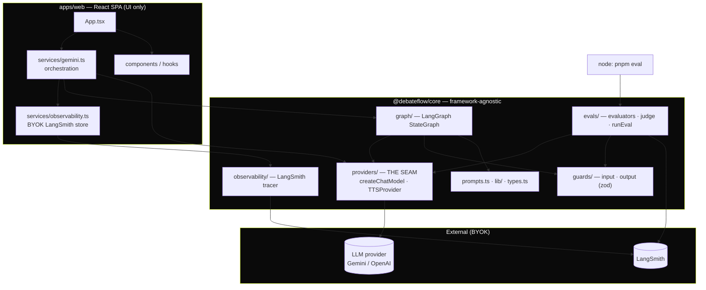
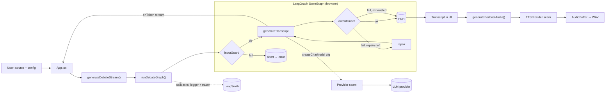

# DebateFlow

Transform any source text into a paced, two-speaker podcast debate transcript — then render
it to multi-speaker audio. The generation pipeline is a **LangGraph** graph with input/output
**guards**; LLMs are reached through a provider-agnostic **seam**; runs can be traced to
**LangSmith** for offline and production **evals**. Runs fully client-side, **BYOK**
(bring-your-own-key), and deploys static to **Cloudflare Pages**.

## Features

- **AI script generation** — convert articles, essays, or notes into natural podcast dialogue
- **Provider-agnostic** — swap the LLM (Gemini, OpenAI, …) by config, not code, via the seam
- **Guarded pipeline** — input validation + output format/safety checks with a bounded repair retry
- **Real-time streaming** — watch the transcript generate live
- **Multi-speaker audio** — Gemini multi-speaker TTS (Puck, Charon, Kore, Fenrir, Zephyr)
- **Evals** — four scored dimensions, offline suite + online (production) evaluators in LangSmith
- **Customizable** — duration (5–60 min), tone, pacing, language, balance, show notes, and more

## Architecture

### Modularity (package & module boundaries)



The web app depends only on `@debateflow/core`; nothing outside `providers/` imports a concrete
model SDK. `core` is consumed as source — `exports` maps `.` → `src/index.ts` and `./evals` →
`src/evals/index.ts`, keeping the Node-only `langsmith` eval glue out of the browser bundle.

### Data flow (debate generation)



`onToken` streams tokens to the UI live; a guard-triggered repair calls `onReset` so the UI
clears before re-streaming. Top-level graph callbacks (logger + optional LangSmith tracer)
propagate to the model run.

## Quick start

```bash
# Prereqs: Node 20+ and pnpm 9+
pnpm install
pnpm dev          # http://localhost:3000
```

On first launch, paste your **LLM provider API key** in the modal (BYOK; held in memory for the
session). Optionally expand **Production tracing** to add a LangSmith key + project. For local
dev you may instead put `GEMINI_API_KEY=...` in a root `.env` (do **not** ship a build made with
that env set — it bakes the key into the static bundle).

## Commands (run from repo root)

| Command | What |
|---|---|
| `pnpm dev` | Vite dev server (port 3000) |
| `pnpm build` | Build the web app → `apps/web/dist` |
| `pnpm preview` | Preview the production build |
| `pnpm typecheck` | `tsc --noEmit` across packages (also run by the Stop hook) |
| `pnpm test` | Vitest unit tests (seam, graph, guards, evaluators) |
| `pnpm eval` | Offline eval suite (needs `GEMINI_API_KEY` + `LANGSMITH_API_KEY`) |

## Evals

Four quality dimensions, defined once and reused by the offline suite and online Run Rules:
**faithfulness**, **format & tag compliance**, **config adherence**, **safety**. See
[`docs/EVALS.md`](docs/EVALS.md) for the offline run and how to wire production (online)
evaluators in your own LangSmith project.

## Project structure

```
apps/web/                 # React 19 + Vite SPA (UI only)
  services/               #   gemini.ts (orchestration), observability.ts (BYOK tracing)
  components/ hooks/ constants.ts
packages/core/            # @debateflow/core — no React, no concrete SDK outside the seam
  src/providers/          #   the seam: createChatModel (registry) + TTSProvider
  src/graph/              #   LangGraph StateGraph + state
  src/guards/             #   input/output guards (zod)
  src/evals/              #   evaluators, judge, seed dataset, runEval.ts
  src/observability/      #   LangSmith tracer
  src/prompts.ts src/lib/ src/types.ts
packages/config/          # shared tsconfig base
wrangler.toml             # Cloudflare Pages (static, apps/web/dist)
.github/workflows/        # ci.yml · deploy.yml · eval.yml
```

## Tech stack

- **Frontend**: React 19, TypeScript, Vite, Tailwind (CDN)
- **Orchestration**: LangGraph (`@langchain/langgraph/web`) + LangChain core
- **Models**: provider-agnostic seam (Gemini 2.5 Flash, OpenAI, …) + Gemini multi-speaker TTS
- **Evals/Observability**: LangSmith (`evaluate()` offline + Run Rules online)
- **Validation/Tests**: zod, Vitest
- **Tooling**: pnpm workspaces; **Cloudflare Pages** static hosting

## Voice profiles & languages

| Name | Gender | Description |
|---|---|---|
| Puck | Male | Deep, rough |
| Charon | Male | Deep, authoritative |
| Kore | Female | Soft, calm |
| Fenrir | Male | High energy |
| Zephyr | Female | Balanced, clear |

Languages: English, Spanish, French, German, Portuguese, Japanese, Persian.

## Deployment (Cloudflare Pages)

Static SPA — no Pages Functions. Build output `apps/web/dist`, SPA fallback via
`apps/web/public/_redirects`. CI (`.github/workflows/deploy.yml`) deploys on push to `main`
using `CLOUDFLARE_API_TOKEN` + `CLOUDFLARE_ACCOUNT_ID` repo secrets.

## Notes

- BYOK: keys are entered at runtime and held in memory only (not persisted).
- Audio synthesis processes in chunks and may take a while for longer scripts; needs a browser
  with Web Audio API.
- All AI operations require an internet connection and a valid provider key.
```
```
