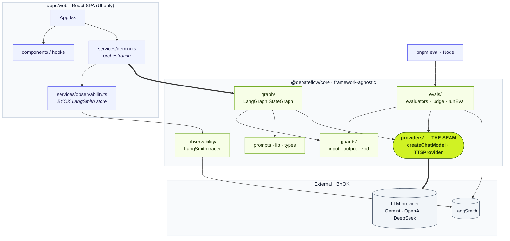
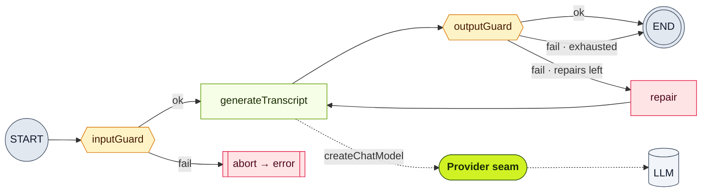
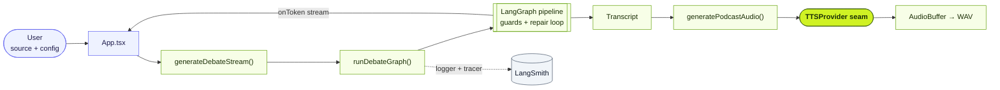

# DebateFlow

Transform any source text into a paced, two-speaker podcast debate transcript — then render
it to multi-speaker audio. The generation pipeline is a **LangGraph** graph with input/output
**guards**; LLMs are reached through a provider-agnostic **seam**; runs can be traced to
**LangSmith** for offline and production **evals**. Runs fully client-side, **BYOK**
(bring-your-own-key), and deploys static to **Cloudflare Pages**.

## Features

- **AI script generation** — convert articles, essays, or notes into natural podcast dialogue
- **Provider-agnostic** — swap the chat LLM (Gemini, OpenAI, DeepSeek) via `config.llm`, not code; the seam lazy-loads only the SDK each provider needs
- **Guarded pipeline** — input validation + output format/safety checks with a bounded repair retry
- **Real-time streaming** — watch the transcript generate live
- **Multi-speaker audio** — Gemini multi-speaker TTS (Puck, Charon, Kore, Fenrir, Zephyr)
- **Evals** — four scored dimensions, offline suite + online (production) evaluators in LangSmith
- **Customizable** — duration (5–60 min), tone, pacing, language, balance, show notes, and more

## Architecture

Three views, from static structure to runtime: **module boundaries**, the **generation state
machine**, and the **end-to-end runtime flow**.

### 1. Module boundaries

The web app depends only on `@debateflow/core`; nothing outside `providers/` (**the seam**, in
lime) imports a concrete model SDK. `core` is consumed as source — `exports` maps `.` →
`src/index.ts` and `./evals` → `src/evals/index.ts`, keeping the Node-only `langsmith` eval glue
out of the browser bundle.



### 2. Generation state machine

The LangGraph `StateGraph` that runs in the browser. The output guard gates a **bounded repair
loop**: on a format/safety failure it re-runs generation (clearing the UI via `onReset`) until
the transcript passes or the repair budget is exhausted.



### 3. End-to-end runtime flow

From a user's source text to streamed transcript to rendered audio. `onToken` streams tokens to
the UI live; top-level graph callbacks (logger + optional LangSmith tracer) propagate to the
model run.



## Quick start

```bash
# Prereqs: Node 20+ and pnpm 9+
pnpm install
pnpm dev          # http://localhost:3000
```

On first launch, paste the **API key for your configured chat provider** in the modal
(BYOK; persisted in `localStorage` and reused across reloads). Optionally expand
**Production tracing** to add a LangSmith key + project (held in memory only). For local
dev with the default Gemini provider you may put `VITE_GEMINI_API_KEY=...` in a root
`.env` — the app reads it only when `import.meta.env.DEV` is true, so production builds
never inline a key.

## Providers

Chat (transcript generation) and TTS (audio) are separate seams in
`packages/core/src/providers/`.

| Layer | Providers | How to choose |
|---|---|---|
| **Chat** | `google-genai`, `openai`, `deepseek` | Set `config.llm` in `apps/web/constants.ts` (`provider`, `model`, optional `baseURL`) |
| **TTS** | `google-genai` only | Set `config.tts` (Gemini multi-speaker) |

`deepseek` uses the same OpenAI-compatible client as `openai`, defaulting to
`https://api.deepseek.com/v1`. The BYOK key in `ApiModal` must match the configured chat
provider. There is no provider picker in the UI yet — change `DEFAULT_CONFIG.llm` to swap.

**CSP:** deployed `connect-src` in `apps/web/public/_headers` allows Gemini + LangSmith
today. If you point the web app at OpenAI or DeepSeek, add the matching API host (or your
custom `baseURL`) there before deploying.

**Offline evals:** `pnpm eval` defaults to Gemini. Override with `EVAL_PROVIDER`
(`google-genai` \| `openai` \| `deepseek`), `EVAL_MODEL`, and `EVAL_BASE_URL`; set the
matching key env var (`GEMINI_API_KEY`, `OPENAI_API_KEY`, or `DEEPSEEK_API_KEY`). See
[`docs/EVALS.md`](docs/EVALS.md).

## Commands (run from repo root)

| Command | What |
|---|---|
| `pnpm dev` | Vite dev server (port 3000) |
| `pnpm build` | Build the web app → `apps/web/dist` |
| `pnpm preview` | Preview the production build |
| `pnpm typecheck` | `tsc --noEmit` across packages (also run by the Stop hook) |
| `pnpm test` | Vitest unit tests (seam, graph, guards, evaluators) |
| `pnpm eval` | Offline eval suite (provider key + `LANGSMITH_API_KEY`; optional `EVAL_PROVIDER`) |

## Evals

Four quality dimensions, defined once and reused by the offline suite and online Run Rules:
**faithfulness**, **format & tag compliance**, **config adherence**, **safety**. The offline
suite runs the same graph through whichever chat provider `EVAL_PROVIDER` selects (default:
Gemini). See [`docs/EVALS.md`](docs/EVALS.md) for the offline run and how to wire production
(online) evaluators in your own LangSmith project.

## Project structure

```
apps/web/                 # React 19 + Vite SPA (UI only)
  services/               #   gemini.ts (orchestration), observability.ts (BYOK tracing)
  components/ hooks/ constants.ts
packages/core/            # @debateflow/core — no React, no concrete SDK outside the seam
  src/providers/          #   the seam: chatModel registry + TTSProvider
    chat/                 #     GoogleGenAI, OpenAI, DeepSeek (OpenAI-compatible)
  src/graph/              #   LangGraph StateGraph + state
  src/guards/             #   input/output guards (zod)
  src/evals/              #   evaluators, judge, seed dataset, runEval.ts
  src/observability/      #   LangSmith tracer
  src/prompts.ts src/lib/ src/types.ts
packages/config/          # shared tsconfig base
wrangler.toml             # Cloudflare Pages (static, apps/web/dist)
.github/workflows/        # ci.yml · deploy.yml · eval.yml
```

## Tech stack

- **Frontend**: React 19, TypeScript, Vite, Tailwind v4 (compile-time via `@tailwindcss/vite`)
- **Orchestration**: LangGraph (`@langchain/langgraph/web`) + LangChain core
- **Models**: chat seam (Gemini, OpenAI, DeepSeek) + Gemini multi-speaker TTS
- **Evals/Observability**: LangSmith (`evaluate()` offline + Run Rules online)
- **Validation/Tests**: zod, Vitest
- **Tooling**: pnpm workspaces; **Cloudflare Pages** static hosting

## Voice profiles & languages

| Name | Gender | Description |
|---|---|---|
| Puck | Male | Deep, rough |
| Charon | Male | Deep, authoritative |
| Kore | Female | Soft, calm |
| Fenrir | Male | High energy |
| Zephyr | Female | Balanced, clear |

Languages: English, Spanish, French, German, Portuguese, Japanese, Persian.

## Deployment (Cloudflare Pages)

Static SPA — no Pages Functions. Build output `apps/web/dist`, SPA fallback via
`apps/web/public/_redirects`. CI (`.github/workflows/deploy.yml`) deploys on version tags
(`v*.*.*`) using `CLOUDFLARE_API_TOKEN` + `CLOUDFLARE_ACCOUNT_ID` repo secrets.

## Notes

- **BYOK:** the LLM provider key is persisted in `localStorage`; LangSmith credentials are
  session-only (not persisted).
- Audio synthesis uses Gemini TTS regardless of which chat provider generates the transcript.
- Audio synthesis processes in chunks and may take a while for longer scripts; needs a browser
  with Web Audio API.
- All AI operations require an internet connection and a valid provider key.
